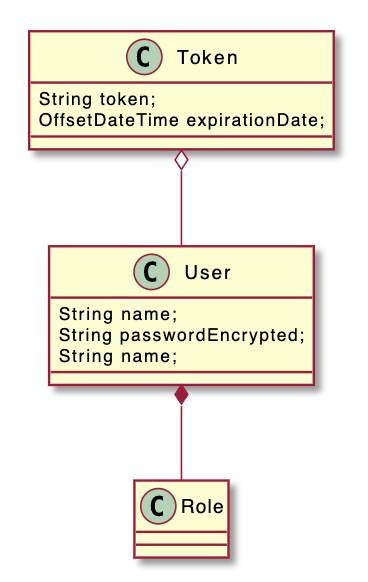

# Authentication and Authorization Service

## Key APIs
- Create a user, including user name, password
- Delete a user
- Create a role
- Delete a role
- Add a role to a user
- Authenticate. Return a temporary token given the correct user-password pair. 
- Invalidate
- Check role
  - input: auth token, and role
  - output: true if the user belongs to this role
- All roles
  - intput: auth token
  - output: all roles of a user

## Class Design




## Project Architecture

The project is organized with four directories. 

- model defines the three entities
- persistence defines the methods to write to and to read from storage. In-memory storage is used in this project. You are supposed to implement IRoleRepository, IUserRepository, and ITokenRepository if you plug in to disk storage, like the MySQL. 
- service is where the core logics are defined
- util contains the static utility classes, like the encryption.


## Run Book

- Load this as a Maven project to Intellij

- run

  ````bash
  mvn test
  ````

  for the API tests.
